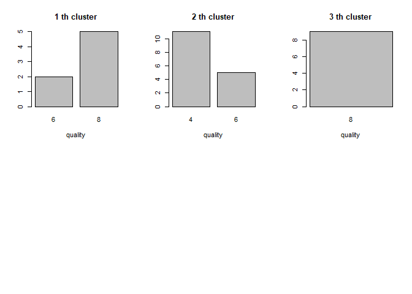

<!-- README.md is generated from README.Rmd. Please edit that file -->

# clustr

<!-- badges: start -->

<!-- badges: end -->

A set of data clustering tools that increases data mining efficiency.

## Installation

You can install the released version of clustr from
[CRAN](https://CRAN.R-project.org) with:

``` r
install.packages("clustr")
```

And the development version from [GitHub](https://github.com/) with:

``` r
# install.packages("devtools")
devtools::install_github("Stevo795/clustr")
```

## Example

This is a basic example which shows you how to solve a common problem:

``` r
library(clustr)
## basic example code
# Input the "label" column as y and the rest of the dataframe as x; 
#  centers: number of clusters
#  nstart: number of random sets to be selected 
data=mtcars
clusters_result = kmeans_hist(y=data$cyl, 
                              x=subset(data, select=- cyl),
                              centers=3,
                              nstart=5)
```



This function returns the result of the clustering

``` r
clusters_result
#>           Mazda RX4       Mazda RX4 Wag          Datsun 710      Hornet 4 Drive 
#>                   2                   2                   2                   1 
#>   Hornet Sportabout             Valiant          Duster 360           Merc 240D 
#>                   3                   1                   3                   2 
#>            Merc 230            Merc 280           Merc 280C          Merc 450SE 
#>                   2                   2                   2                   1 
#>          Merc 450SL         Merc 450SLC  Cadillac Fleetwood Lincoln Continental 
#>                   1                   1                   3                   3 
#>   Chrysler Imperial            Fiat 128         Honda Civic      Toyota Corolla 
#>                   3                   2                   2                   2 
#>       Toyota Corona    Dodge Challenger         AMC Javelin          Camaro Z28 
#>                   2                   1                   1                   3 
#>    Pontiac Firebird           Fiat X1-9       Porsche 914-2        Lotus Europa 
#>                   3                   2                   2                   2 
#>      Ford Pantera L        Ferrari Dino       Maserati Bora          Volvo 142E 
#>                   3                   2                   3                   2
```
